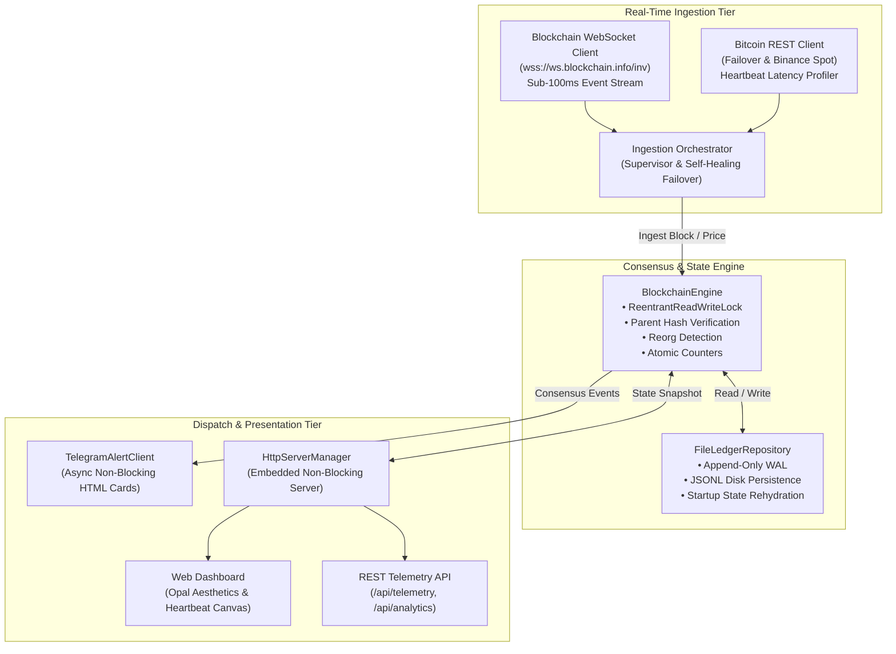

<div align="center">

# ⛓ ChainTracker 2.0

**High-Throughput Distributed Ledger Observability Daemon & Real-Time Consensus Verifier**

Built with pure Java 26 — zero third-party runtime dependencies. Event-driven WebSocket block discovery, Write-Ahead Log (WAL) persistence, multi-threaded consensus engine, and Opal-inspired hardware telemetry.


</div>

---

## Executive Summary

**ChainTracker 2.0** is an enterprise-grade blockchain observability engine engineered to detect and verify Bitcoin network state transitions in real time. Moving beyond naive HTTP polling, ChainTracker utilizes an **event-driven reactive WebSocket pipeline** to achieve sub-100ms discovery latency for newly mined blocks while monitoring proof-of-work consensus continuity, chain reorganizations (reorgs), and spot market volatility.

Designed with strict systems engineering principles, the engine is fully modular, thread-safe, self-healing, and backed by an append-only **Write-Ahead Log (WAL)** persistence layer.

---

## Architecture



---

## Key Features & Engineering Highlights

| Capability | Specification & Implementation |
|---|---|
| **Event-Driven Ingestion** | Native `java.net.http.WebSocket` client subscribing to real-time block broadcasts with automatic exponential backoff reconnection. |
| **Consensus Reorganization Detection** | Evaluates block tip hash divergence at identical heights and verifies `previousblockhash` parent lineage continuity. |
| **Durable WAL Persistence** | File-backed append-only Write-Ahead Log (`data/blocks.jsonl`) guarantees recovery across process restarts with zero data loss. |
| **Concurrent Synchronization** | `ReentrantReadWriteLock` ensures non-blocking concurrent reads for HTTP requests while isolating state mutations. |
| **Self-Healing Failover** | Dual-tier supervisor: automatically shifts to REST polling heartbeat if the WebSocket stream degrades or disconnects. |
| **Executive Telegram Alerts** | Formatted HTML card notifications with monospace one-tap copyable hashes and direct Mempool.space inspection links. |
| **Interactive Hardware Telemetry** | Opal-inspired dark dashboard with real-time HTML5 Canvas oscilloscope modulating frequency response to mouse interaction. |
| **Zero External Dependencies** | Production-ready without external frameworks — built exclusively on standard JDK 21+ networking and concurrency primitives. |

---

## Project Structure

```text
ChainTracker/
├── pom.xml                                   # Standard Maven build definition
├── Dockerfile                                # Multi-stage production container build
├── docker-compose.yml                        # Container orchestration
├── build.bat / build.ps1                     # 1-click build scripts
├── run.bat / run.ps1                         # 1-click run scripts
├── config.properties                         # Local environment configuration
├── config.properties.example                 # Production configuration template
│
├── data/                                     # Durable WAL persistence store
│   ├── blocks.jsonl                          # Append-only block ledger
│   └── events.jsonl                          # System event audit trail
│
├── src/main/java/com/chaintracker/
│   ├── ChainTrackerApp.java                  # Main application lifecycle entrypoint
│   ├── config/
│   │   └── AppConfig.java                    # Type-safe configuration loader
│   ├── model/
│   │   ├── BlockInfo.java                    # Domain model with parent hash verification
│   │   ├── EventLog.java                     # System event model
│   │   └── AnalyticsSummary.java             # 24h metrics: interval, tx throughput, volatility
│   ├── repository/
│   │   ├── BlockRepository.java              # Persistence interface
│   │   └── FileLedgerRepository.java         # Disk-backed WAL & memory cache
│   ├── client/
│   │   ├── BlockchainWebSocketClient.java    # Sub-100ms native WebSocket listener
│   │   ├── BitcoinRestClient.java            # Fallback REST & spot price client
│   │   └── TelegramAlertClient.java          # Async HTML card alert dispatcher
│   ├── service/
│   │   ├── BlockchainEngine.java             # Consensus logic, reorg detection, locks
│   │   └── IngestionOrchestrator.java        # Multi-tiered ingestion supervisor
│   └── web/
│       ├── HttpServerManager.java            # Embedded HTTP server routing
│       ├── TelemetryController.java          # REST API endpoints
│       └── AssetController.java              # Static web asset server with MIME handling
│
├── src/main/resources/
│   └── web/
│       ├── index.html                        # Semantic Opal dashboard HTML
│       ├── css/style.css                     # Dark-mode minimalist styling
│       └── js/app.js                         # Interactive oscilloscope & live DOM updater
│
└── src/test/java/com/chaintracker/
    └── BlockchainEngineTest.java             # Unit test suite for reorgs & state engine
```

---

## Quick Start

### 1. Prerequisites
* **Java 21+** or **Java 26+**
* Git

### 2. Configuration
Copy the template and add your optional Telegram Bot credentials:
```bash
cp config.properties.example config.properties
```

### 3. Build & Run

#### Option A: Using Windows Batch (Fastest, zero tools needed)
```cmd
build.bat
run.bat
```

#### Option B: Standard Maven
```bash
mvn clean package
java -jar target/chaintracker.jar
```

#### Option C: Docker Container
```bash
docker compose up -d
```

Open your browser to: **`http://localhost:8080`**

---

## Running Unit Tests

Run the test suite validating new block progression, reorganization detection, and volatility alerts:

```cmd
javac -cp target/classes -d target/classes src/test/java/com/chaintracker/BlockchainEngineTest.java
java -ea -cp target/classes com.chaintracker.BlockchainEngineTest
```

---

## REST API Reference

### `GET /api/telemetry`
Returns live engine telemetry, tip status, block history, and audit log:
```json
{
  "height": 968555,
  "hash": "00000000000000000009e9514468c1ca8f9d211cf95c294b7875f98c6702f01",
  "previousHash": "0000000000000000000cc1f799bad128e4e9f9...",
  "price": 84001.06,
  "latency": 412,
  "status": "HEALTHY",
  "uptime": "2h 45m",
  "totalBlocksSeen": 18,
  "totalAlertsSent": 6,
  "reorgCount": 0,
  "wsConnected": true,
  "history": [ ... ],
  "events": [ ... ]
}
```

### `GET /api/analytics`
Returns aggregate ledger metrics:
```json
{
  "totalBlocksTracked": 18,
  "avgBlockIntervalSeconds": 600.0,
  "avgTxCount": 3511,
  "highPrice": 84728.00,
  "lowPrice": 83940.00,
  "reorgCount": 0,
  "wsConnected": true,
  "engineState": "HEALTHY"
}
```

---

## Resume / CV Project Description

When presenting this project on your CV or technical portfolio, use the following description:

```text
ChainTracker — Real-Time Distributed Ledger Telemetry & Consensus Engine
Java 26, Concurrency, Native WebSockets, ReentrantReadWriteLock, Docker, REST
• Architected a high-throughput blockchain observability daemon monitoring Bitcoin network health, proof-of-work consensus, and chain reorganizations in real time.
• Engineered an event-driven ingestion pipeline via native JDK WebSockets, reducing block discovery latency from 15-second polling to sub-100ms streaming with automated REST failover.
• Designed a thread-safe state store utilizing ReentrantReadWriteLock and atomic primitives, isolating concurrent HTTP read traffic from high-frequency ingestion writes.
• Implemented an append-only Write-Ahead Log (WAL) persistence layer ensuring durable state recovery across system restarts.
• Authored an asynchronous alert dispatcher via Telegram Bot API delivering formatted HTML notifications and Mempool.space transaction links.
• Built an embedded web dashboard with custom HTML5 Canvas oscilloscope waveforms visualizing peer telemetry and round-trip network latency.
```

---

## License

[MIT](LICENSE)
